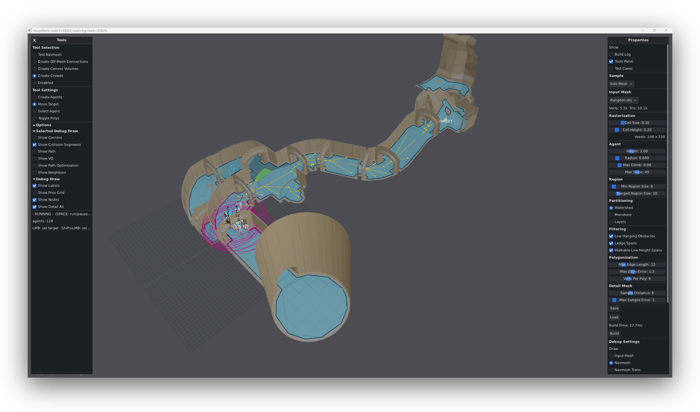

# zig-recast

A Zig port of the [Recast & Detour](https://github.com/recastnavigation/recastnavigation)
navigation-mesh toolkit — navmesh baking, pathfinding, crowd simulation, and a
tile cache for dynamic obstacles.

English | [Русский](README.ru.md)
<p align="center">
  
</p>



The screenshot above is the bundled GUI demo (`zig build run-demo`), a Zig/dvui
rebuild of the original RecastDemo tools.

## What this is

The code follows the upstream C++ structure closely — file-for-file and, where
it matters, line-for-line — so it can be checked against the reference and track
its updates. The port keeps the original `i32` core fields and data layout for
fidelity, and adds Zig conventions on top: explicit allocators, error unions
instead of boolean returns, and `defer`-based cleanup.

The Recast bake, Detour queries, crowd, and tile cache pipelines are fully
ported and covered by the unit + integration suites (`zig build test`).

## Modules

| Module | Purpose |
| --- | --- |
| `recast` | Build a navmesh from triangle soup: heightfield → compact heightfield → regions → contours → poly mesh → detail mesh. |
| `detour` | Runtime navmesh + queries: A\* and sliced pathfinding, string-pulling, raycast, nearest-poly, random points, wall distance. |
| `detour_crowd` | Multi-agent steering: path corridors, local boundary, obstacle avoidance, async replanning through a path queue. |
| `detour_tilecache` | Compressed tiles with run-time obstacles (box / cylinder / oriented box) and incremental navmesh rebuilds. |
| `debug` | Debug-draw primitives and binary dump/read of intermediate structures (used by the demo). |

## Requirements

- **Zig 0.16.0** (the demo dependency `dvui` requires it; the library itself is
  plain Zig). Lib core 0.15.x will build.

## Build & test

```bash
zig build                 # build the library
zig build test            # unit + integration tests
zig build test-integration

zig build examples        # build the example executables
zig build bench-recast    # benchmarks: -recast / -detour / -crowd
```

## Run the demo

A dvui GUI (GLFW + OpenGL) that loads geometry, bakes a navmesh, and exposes the
RecastDemo tools — NavMesh Tester, Crowd, Tile, and the debug overlays.

```bash
zig build run-demo
```

## Examples

Add the dependency to your `build.zig.zon` and import the module
(`@import("recast-nav")`): the `recast` half (alias `rc`) bakes a mesh, the
`detour` half (alias `dt`) queries it, and the common types (`Vec3`, `Context`,
`RecastConfig`, `Heightfield`, …) are re-exported at the root; the build functions
sit under file-namespaces (`rc.rasterization`, `rc.filter`, …) mirroring the
upstream C++ source files. The examples are the living, executable reference for
the API — each builds **and runs** in CI (`zig build examples` builds all,
`zig build run-<name>` runs one). Start with
[`03_full_pathfinding`](examples/03_full_pathfinding.zig) (complete bake → query):

| Example | Demonstrates |
|---|---|
| [`03_full_pathfinding`](examples/03_full_pathfinding.zig) | complete bake → navmesh → `findPath`/`findStraightPath` |
| [`simple_navmesh`](examples/simple_navmesh.zig) | the minimal bake (triangles → navmesh data) |
| [`pathfinding_demo`](examples/pathfinding_demo.zig) | query suite: nearest poly, path, raycast, area & wall queries |
| [`02_tiled_navmesh`](examples/02_tiled_navmesh.zig) | two stitched tiles, a path crossing the tile border |
| [`06_offmesh_connections`](examples/06_offmesh_connections.zig) | an off-mesh link (jump/teleport) bridging disconnected areas |
| [`crowd_simulation`](examples/crowd_simulation.zig) | DetourCrowd steering several agents to a shared goal |
| [`dynamic_obstacles`](examples/dynamic_obstacles.zig) | DetourTileCache run-time obstacles re-routing a path |
| [`advanced/custom_areas`](examples/advanced/custom_areas.zig) | custom area types + per-area query cost |
| [`advanced/hierarchical_pathfinding`](examples/advanced/hierarchical_pathfinding.zig) | sliced/incremental pathfinding across frames |
| [`advanced/streaming_world`](examples/advanced/streaming_world.zig) | tiles streamed in/out as an agent moves |

## Differences from the C++ version

- **Memory** — every builder takes an explicit `std.mem.Allocator`; there is no
  global allocator. Structures own their buffers and free them in `deinit`.
- **Errors** — fallible operations return Zig error unions (`!T`) instead of
  `bool` + out-params.
- **Types** — core recast/detour fields stay `i32` to mirror the C++ layout
  (many are signed sentinels); `usize` getters are layered on top for clean Zig
  call sites.

## Benchmarks

[Zig core](https://github.com/K4leri/recastnavigation/tree/benchmark) vs the upstream [C++ recastnavigation reference](https://github.com/K4leri/recastnavigation-bench),
measured fairly: identical dense game maps, one shared deterministic input contract,
C++ built `/arch:AVX2` + strict IEEE float. Each function is timed **K=15 runs/side,
interleaved**, reported as the **median Zig÷C++ time with a 95 % bootstrap CI**;
sub-~200 ns zones (below the timer floor) are excluded as quantization noise.
`ratio < 1.00 = Zig faster`.

| Layer | Zig÷C++ | Speed | Measurable zones (faster / slower / tie) |
|---|:--:|---|---|
| **BUILD** · navmesh bake | **0.82** | `▓▓▓▓▓▓░░░░` 1.22× faster | 157 faster · 14 slower · 18 tie |
| **CROWD** · agent steering | **0.83** | `▓▓▓▓▓▓░░░░` 1.20× faster | 68 faster · 10 slower · 3 tie |
| **QUERY** · pathfinding / queries | **0.93** | `▓▓░░░░░░░░` 1.07× faster | 7 faster · 1 slower · 4 tie |
| **TILECACHE** · dynamic obstacles | **0.98** | `▓░░░░░░░░░` 1.02× faster | 27 faster · 9 slower · 4 tie |

**Overall ≈ 0.85** (geometric mean over 322 trusted zones) — every layer at or
above C++ speed. The wins come from data-layout and `comptime` at the
pipeline-stage level; leaf math is already optimal (every analog proved
bit-identical or was rejected by the identity gate). **No SIMD** (`@Vector` is
intentionally out of scope).

Full per-zone tables, confidence intervals, and methodology are in
[`docs/perf-audit/`](docs/perf-audit/). Numbers are measured on the
[`benchmark` branch](https://github.com/K4leri/recastnavigation/tree/benchmark)
(Tracy instrumentation + optimization experiments live there; the shipping
`master` core carries only the proven, output-identical wins).

## Roadmap

Correctness and fidelity came first and are done. Performance is **characterized,
not guessed** — see [Benchmarks](#benchmarks) above. One optional module is on the
horizon beyond the 1:1 port:

**Influence maps (`DetourInfluence`) — in active development.** An optional,
opt-in tactical layer over the navmesh (threat / visibility / territory fields
with temporal decay and "find the safest spot" queries), in the spirit of the
upstream proposal
([discussion #794](https://github.com/recastnavigation/recastnavigation/discussions/794)).
An independent module like DetourCrowd, layered on top of the solid core port.

## Layout

```
src/
  math.zig            vectors, geometry helpers
  context.zig         build context + logging sink
  recast/             navmesh baking pipeline
  detour/             navmesh runtime + queries + builder
  detour_crowd/       crowd, corridor, avoidance, path queue
  detour_tilecache/   tile cache + obstacles
  debug/              debug-draw + dump
examples/             runnable usage examples
bench/                benchmarks
demo/                 dvui GUI demo (zig build run-demo)
test/                 unit + integration tests
```

## License

zlib, the same as upstream RecastNavigation. See [LICENSE](LICENSE).

Original C++ Recast & Detour © Mikko Mononen. This is an independent Zig port.

## Links

- [RecastNavigation](https://github.com/recastnavigation/recastnavigation) — the C++ reference
- [Zig](https://ziglang.org/)
